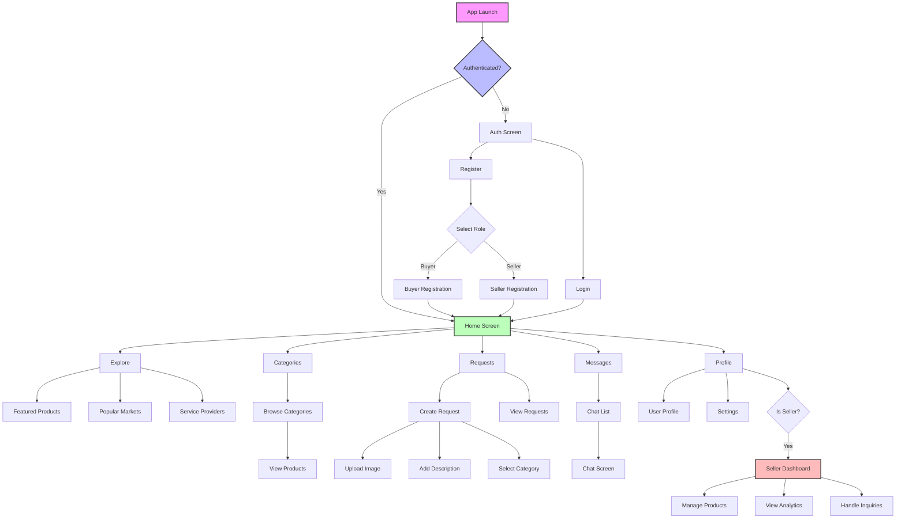

# iMarket User Flow Documentation

## 1. Authentication Flow

### 1.1 Initial Access
- User opens app
- Redirected to authentication screen if not logged in
- Options to:
  - Sign up as buyer
  - Sign up as seller
  - Login with existing account

### 1.2 Registration Process
- Enter email and password
- Select role (buyer/seller)
- Account creation and profile setup
- Automatic login after registration

### 1.3 Login Process
- Enter email and password
- Role-based redirection:
  - Buyers → Explore screen
  - Sellers → Choice between buyer/seller mode

## 2. Buyer Flow

### 2.1 Product Discovery
- Browse featured products on home screen
- Explore markets and categories
- Search products by:
  - Text search
  - Visual search (camera/image upload)
  - Category navigation

### 2.2 Product Request Flow
1. Create request:
   - Upload product image
   - Add description
   - Select category
   - Submit request
2. Receive seller responses:
   - View price offers
   - Read seller messages
   - Compare multiple offers
3. Interact with sellers:
   - Chat with interested sellers
   - Negotiate prices
   - Discuss details

### 2.3 Market Exploration
- Browse popular markets
- View market details:
  - Operating hours
  - Location
  - Available shops
  - Categories
- Navigate to physical shops using in-app maps

### 2.4 Communication
- Chat with sellers
- Receive notifications for:
  - New responses to requests
  - Price updates
  - Seller messages
- Manage conversation history

## 3. Seller Flow

### 3.1 Dashboard Access
- Switch between buyer/seller modes
- View key metrics:
  - Total products
  - Active requests
  - Response rate
  - Sales analytics

### 3.2 Product Management
1. Add products:
   - Upload product images
   - Set name and description
   - Define price
   - Select category
   - Set quantity
2. Manage inventory:
   - Update product details
   - Adjust prices
   - Modify stock levels
   - Archive/activate products

### 3.3 Request Response Flow
1. View relevant requests:
   - Browse by category
   - Filter by status
2. Respond to requests:
   - Send price quotes
   - Attach product details
   - Communicate with buyers
3. Manage responses:
   - Track sent responses
   - Update offers
   - Follow up with buyers

### 3.4 Communication Management
- Respond to buyer inquiries
- Manage multiple conversations
- Receive notifications for:
  - New product requests
  - Buyer messages
  - Request updates

## 4. Notification System

### 4.1 Buyer Notifications
- New responses to requests
- Price updates from sellers
- Chat messages
- Request status changes

### 4.2 Seller Notifications
- New product requests in their category
- Buyer messages
- Response status updates
- Market updates

## 5. Profile Management

### 5.1 Buyer Profile
- Update personal information
- View request history
- Manage notifications
- Track favorite sellers/products

### 5.2 Seller Profile
- Manage shop information
- Update business details
- Configure notification preferences
- View analytics and performance metrics

## 6. Settings and Preferences

### 6.1 General Settings
- Language preferences
- Notification settings
- Theme selection
- Privacy settings

### 6.2 Account Management
- Change password
- Update email
- Manage roles
- Delete account

## 7. Error Handling

### 7.1 Connection Issues
- Offline mode support
- Data synchronization
- Retry mechanisms
- Error notifications

### 7.2 Input Validation
- Form validation
- Image upload restrictions
- Price range validation
- Category selection validation

## 8. Security Measures

### 8.1 Authentication Security
- Session management
- Token-based authentication
- Secure password storage
- Two-factor authentication (optional)

### 8.2 Data Protection
- Encrypted communication
- Secure file storage
- Privacy policy compliance
- Data access controls

## 9. Performance Optimization

### 9.1 Data Loading
- Progressive image loading
- Infinite scrolling
- Data caching
- Background updates

### 9.2 Resource Management
- Memory optimization
- Battery usage optimization
- Network bandwidth management
- Storage optimization

# User Flow Diagram

